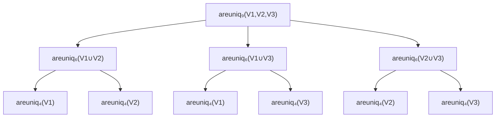

# Uniqenum and the Recursive Expression of the Vandermonde Determinant

## 1. Abstract

This paper presents `uniqenum`, a family of C macros that generate compile-time verified enumerations, guaranteeing value uniqueness through an algebraic identity derived from the Vandermonde determinant. The method balances static safety with preprocessor limits by using recursive tiling and file segmentation strategies.

## 2. Introduction

Programming with enumerations feels safe until a conditional build flag, arithmetic initializer, or copy-pasted macro quietly assigns two names the same value. The resulting bugs manifest as unreachable `switch` labels, ioctl handlers that never fire, or ABI mismatches that only appear on particular platforms. Manual audits or linters rarely catch these collisions because the integer values are the result of nested macros and preprocessor math.

`uniqenum` tackles this issue by interpreting every enum declaration as a proof obligation. On the programming side, the macros keep the familiar C syntax, emit `_Static_assert` checks automatically, and let build systems consume pre-generated headers. On the mathematical side, the construction leverages the Vandermonde determinant, reinterpreting compile-time uniqueness as the non-zero evaluation of a structured polynomial. The C preprocessor is simultaneously an adversary—imposing depth and file-size ceilings—and a playground where algebraic structure can be encoded into macros.

This paper caters to both audiences: programmers gain practical invariants, and mathematicians see how recursive clique tilings reduce a quadratic Vandermonde expansion to linear textual size. Throughout, the emphasis stays on method rather than any particular codebase so that the ideas can be reimplemented independently.

## 3. Problem Definition

Enumerations are compile-time maps from identifiers to integers. We call an enum “unique” when:

1. $$\forall i \ne j: \operatorname{value}(E_i) \ne \operatorname{value}(E_j).$$
2. Violations are diagnosed during compilation.
3. The verification mechanism itself respects compiler limits on macro recursion depth, translation-unit size, and `_Static_assert` complexity.

Duplicate values cause silent semantic drift. A reproducible “bug before” scenario is shown below; both enums accidentally emit the same opcode once macros are resolved.

```c
#define MAKE_CMD(dir, size, device, nr) \
    (((dir) << 30) | ((size) << 16) | ((device) << 8) | (nr))

enum foo_cmd {
    FOO_PING = MAKE_CMD(0, 0, 'F', 0x03),
    BAR_CLONE = MAKE_CMD(3, 8, 'B', (FOO_PING & 0xFF) + 1),
};

enum bar_cmd {
    BAR_COPY  = MAKE_CMD(1, 16, 'B', 0x01),
    BAR_CLONE = MAKE_CMD(3, 8, 'B', 0x02), /* Collides with foo_cmd::BAR_CLONE */
};
```

C compilers typically cap macro recursions between 100 and 256 expansions, and preprocessing extremely large headers taxes both humans and build servers. Any practical solution must therefore (a) express uniqueness as reusable macros, (b) let users choose between “assert once” (single product) and “assert all” (per-pair diagnostics), and (c) shard code so each header remains within a fixed byte budget.

## 4. Theoretical Foundation

### 4.1 Vandermonde determinant

The classical Vandermonde determinant connects distinctness with the non-zero value of

$$
V_N(a_1,\dots,a_N) = \prod_{1 \le i < j \le N} (a_i - a_j).
$$

If any $a_i = a_j$ the corresponding factor vanishes, taking the product to zero. In `_Static_assert`, any expression that is zero iff duplicates exist is sufficient, so $V_N$ is an ideal candidate.

### 4.2 Recursive framing via right triangles

A naïve expansion enumerates all $\binom{N}{2}$ differences, typically arranged as a right triangle of factors. Appending the $N$-th element simply adds one more row containing $(a_k - a_N)$ for $k < N$.

```text
(a1 - a2)
(a1 - a3)(a2 - a3)
(a1 - a4)(a2 - a4)(a3 - a4)
(a1 - a5)(a2 - a5)(a3 - a5)(a4 - a5)
(a1 - a6)(a2 - a6)(a3 - a6)(a4 - a6)(a5 - a6)
(a1 - a7)(a2 - a7)(a3 - a7)(a4 - a7)(a5 - a7)(a6 - a7)
```

Figure 1 — Vandermonde triangle representation for increasing $N$.

Recognizing this structure invites recursion: rather than emit every pair, express $V_N$ via smaller Vandermonde products that collectively cover all unordered pairs.

### 4.3 Comparative summary of recursive strategies

Four strategies were investigated before settling on the clique method. Their characteristics are summarized in Table 1.

Table 1 — Comparative summary of Vandermonde recursion strategies.

| Method    | Recurrence idea | Depth bound | Child sizes per level | Per-level textual cost | Notes |
|-----------|-----------------|-------------|------------------------|------------------------|-------|
| Expanded  | Emit every unordered pair once | 1 | — | $2\binom{N}{2}$ identifiers | Baseline; quadratic size. |
| Row       | Add rows one by one (grouped by right operand) | $N-1$ | single child of size $N-1$ | $3N-2$, reducible to $2N-1$ with additional helper macros the last row | Linear but exceeds depth limits for large $N$. Can require helpers for the last row. |
| Triangles | Split right triangle into central near-square plus two half triangles | $\lceil \log_2 N \rceil$ | $\lfloor N/2 \rfloor$, $\lceil N/2 \rceil$ | Between $2N$ and $N+\lfloor N^2/2 \rfloor$, depending on available helpers for the central near-square. | Balances depth but requires many helper forms. |
| Cliques ($k=3$) | Cover complete graph with pairwise unions of $k$ balanced partitions | $\lceil \log_{3/2} N \rceil$ | $\lfloor 2N/3 \rfloor$, $\lceil 2N/3 \rceil$ | $N(k-1)$ | Adopted method; linear text and shallow depth. |

### 4.4 Visualizing clique recursion

Balanced clique recursion mirrors a triangle-of-triangles tiling. The example below shows $N=9$ split into three blocks $(V_1,V_2,V_3)$.



Figure 2 — Clique-based recursion tree (k=3) for $N=9$.

The tree stops once a node size reaches the base case (typically $N \le 3$) where direct products are emitted.

### 4.5 Clique method explanation

Let $K_N$ denote the complete graph on vertices $\{1,\dots,N\}$. Associate each edge $\{i,j\}$ with the factor $(a_i - a_j)$. Any edge cover by cliques yields a valid Vandermonde expression.

**Problem statement.** Given integers $(a_1,\dots,a_N)$, define
$$
V_N(a_1,\dots,a_N) = \prod_{1 \le i < j \le N} (a_i - a_j).
$$
Find a recursively defined product of Vandermonde terms that is zero iff some $a_i = a_j$ yet grows only linearly in textual size.

**Edge–clique cover viewpoint.** Select a family of cliques $\mathcal{C} = \{C_1,\dots,C_t\}$ where each $C_k \subseteq \{1,\dots,N\}$. Define
$$
F_{\mathcal{C}} = \prod_{k=1}^t \prod_{\{i,j\} \subseteq C_k} (a_i - a_j).
$$
If every edge of $K_N$ lies in at least one $C_k$, then $F_{\mathcal{C}} = 0$ iff some pair collides. Multiplicities do not hurt because `_Static_assert` only cares about zero vs non-zero.

**Per-level cost lower bound.** When no clique spans all vertices, every vertex must appear in at least two cliques, implying
$$
\sum_{k=1}^t |C_k| \ge 2N.
$$
The $k=3$ construction attains this bound exactly.

**Partition construction.** Partition the vertices into $k \ge 3$ near-equal parts $V_1,\dots,V_k$. For each unordered pair $(i,j)$, add clique $C_{ij} = V_i \cup V_j$. Every intra-part edge is covered because $V_i$ participates in $(k-1)$ such unions, and every inter-part edge appears in precisely one clique. Child sizes are bounded by $\lceil 2N/k \rceil$, yielding the recurrence
$$
d(N) \le 1 + d\left(\left\lceil \frac{2N}{k} \right\rceil\right).
$$

**Choosing $k$.** Larger $k$ reduces depth but increases per-level text:

- $k=3$: depth $\lceil \log_{3/2} N \rceil$, cost $2N$.
- $k=4$: depth $\lceil \log_2 N \rceil$, cost $3N$.
Since typical compilers allow depth $D \approx 200$, $k=3$ provides optimal size without approaching the limit (even $N=10^6$ stays below 40 levels).

**Self-similarity.** The $k=3$ recursion mirrors a Sierpiński-like tiling: each level computes three smaller Vandermonde products over pairwise unions $(V_i \cup V_j)$. Parameter order is preserved so that the generator can splice slices directly.

## 5. Design and Implementation

The macro surface consists of two families:

- `areuniqN` expands to a pure expression equal to $V_N(a_1,\dots,a_N)$. In “assert once” mode it is multiplied into a single `_Static_assert`.
- `uniqenumN` wraps a conventional `enum` definition followed by either a single `_Static_assert(areuniqN(...), msg)` or a series of per-pair assertions in “assert all” mode.

Base cases (`N=2` and `N=3`) are emitted explicitly using straight products of differences. For $N \ge 4`, the generator partitions arguments into three nearly equal blocks $(A,B,C)$ and emits:

```c
#define areuniqN(args...) \
    areuniq_{|A∪B|}(A,B) * \
    areuniq_{|A∪C|}(A,C) * \
    areuniq_{|B∪C|}(B,C)
```

A deterministic identifier function, `ident(n)`, maps integers to macro parameter names using a bijective base-63 (except for the first digit, which is in base 52 as it cannot be a digit) alphabet (`[a-z][A-Z]_ [1-9][0]`). This keeps headers reproducible regardless of generation order, while keeping parameters as short as what C identifiers allow.

Because each `areuniqN` depends on smaller macros, headers are sharded by byte budget (for example 256 KiB). When the generator approaches the limit, it starts a new shard, emits include guards, and adds `#include` statements for all newly required child ranges. Dependency ranges shrink with $N$, so later shards often depend on only one prior shard even though earlier ones may need two.

Configurable constraints include:

- Target `N` range (single value or inclusive interval).
- Which macro families to emit (`areuniq`, `uniqenum`, or both).
- Assertion style (`once` vs `all`) and custom error messages.
- Include guard strategy (classical `#ifndef`, `#pragma once`, or omitted when embedding).
- Output destination: standard output, monolithic header, or directory tree with size-capped files.

## 6. Optimization and Trade-offs

- **Clique vs. naïve expansion.** Cliques cut textual growth from $\Theta(N^2)$ to $\Theta(N)$ while keeping depth logarithmic. The cost bound of $2N$ per level is provably minimal for non-trivial covers.
- **Code size vs. macro depth.** Choosing $k=3$ saturates the cost lower bound; larger $k$ would outpace it without substantial depth gains for practical $N$. Triangle recursion offers slightly shallower trees but introduces sizable helper macros for the central rectangle.
- **Human readability vs. generator compactness.** Retaining ordered parameters within each block lets developers map macro arguments back to their enums, at the expense of repeating identifiers instead of using automatically numbered temporaries.
- **Deterministic identifiers.** The mixed-radix `ident` encoder maintains short names and predictable growth governed by
  $$
  c_{\text{ident}}(N) = \left\lceil \log_{63} \frac{31N}{26} \right\rceil,
  $$
  ensuring that the cumulative identifier length scales gently even for large $N$.
- **Assertion variants.** “Assert once” minimizes emitted diagnostics (one `_Static_assert`) and keeps `areuniqN` reusable as an expression; “assert all” expands each pair into its own `_Static_assert`, providing precise culprit identification at the cost of more preprocessing. A hybrid mode (“assert once” for production, “assert all” for debug builds) falls out naturally because both forms reuse the same Vandermonde products.
- **Generation compactness.** The same recursion tree drives both macro families; caching subtrees allows the generator to emit each `areuniqM` once even if multiple parents reference it.

## 7. Tooling and Usage

A command-line interface wraps the generator with options tailored for build integration:

```sh
uniqenum 2 512 --areuniq --uniqenum \
    --max-size 262144 \
    -d build/include/uniqenum \
    --guard pragmaOnce
```

Key capabilities:

- Emit a single `N` or a range `[N_{\text{start}}, N_{\text{end}}]`, with `inf` supported for open-ended generation (subject to `--max-size`).
- Select macro families (`--areuniq`, `--uniqenum`) and manage dependencies automatically or opt out when embedding existing proofs.
- Choose output targets: stdout streaming, monolithic header (`-o file.h`), or directory sharding with configurable byte caps.
- Customize assertion messages, include guards, and naming templates so the macros integrate with project-specific conventions.

A programmatic API mirrors these options for scripts that need stricter typing or incremental generation. Typical usage:

```ts
generate({
    range: { start: 1, end: 1024 },
    macros: ['areuniq', 'uniqenum'],
    dependencies: 'include',
    assert: { when: 'once', msg: ['duplicate enum values: ', { ref: 'name' }] },
    output: { kind: 'directory', path: 'include/uniqenum', maxFileSize: 256 * 1024 }
});
```

Generated headers follow a predictable pattern:

```c
#define areuniq6(a,b,c,d,e,f) \
    areuniq4(a,b,c,d) * \
    areuniq4(a,b,e,f) * \
    areuniq4(c,d,e,f)

#define uniqenum6(name, ...) \
    enum name { __VA_ARGS__ }; \
    _Static_assert(areuniq6(__VA_ARGS__), "enum values must be unique")
```

Because dependencies are emitted in dependency order, integrating the headers requires only including the shard containing the desired `N`; its prerequisites are already chained via `#include`.

## 8. Evaluation

Quantitative evaluation focuses on macro depth, file size, and compiler impact. The generator logs depth automatically, so recording compile-time and memory becomes a matter of instrumenting a build. Table 2 is a template to be filled once benchmarks are run.

Table 2 — Placeholder for empirical results (fill in after benchmarking).

| N range | File bytes | Max macro depth | Compile time (s) | Assert mode | Notes |
|---------|------------|-----------------|------------------|-------------|-------|
| 2–64    | [TBD]      | [TBD]           | [TBD]            | once        | Baseline sanity check. |
| 65–256  | [TBD]      | [TBD]           | [TBD]            | once        | Sharded into first two files. |
| 257–1024| [TBD]      | [TBD]           | [TBD]            | all         | Stress test diagnostics. |

The system fails gracefully in two situations:

1. **File-size cap exceeded.** The generator stops the current shard when the next macro would cross `maxBytes`, starts a new file, and records the dependency chain.
2. **Depth limit approached.** Because $d(N) \approx \log_{3/2} N$, even $N=10^6$ stays below 40 levels, so mainstream compiler limits ($D \ge 200$) are not reached. Should a stricter environment appear, switching to $k=4$ can drop the depth further at the expense of size.

A sample compiler diagnostic when duplicates are detected:

```text
<generated>/uniqenum_256.h:142:5: error: static assertion failed: duplicate enum values: color color_t
```

When “assert all” is enabled the diagnostic pinpoints the colliding pair:

```text
<generated>/uniqenum_256.h:118:5: error: static assertion failed: (GREEN) != (REDGREEN)
```

## 9. Discussion / Future Work

Several questions remain open:

- **Preprocessor performance ceiling.** Although textual size is linear, the preprocessor still expands products representing all unordered pairs. Measuring when this becomes impractical on various toolchains (GCC, Clang, MSVC) is future work.
- **Assertion strategy benchmarking.** “Assert all” may increase memory but shorten debugging time; comparative metrics would inform default settings.
- **Automatic refactoring tooling.** Converting existing codebases into `uniqenum` macros could be automated by parsing enums, inferring desired synonym groups, and inserting the appropriate macro arity.
- **Alternative clique parameters.** Exploring heterogeneous $k$ per level (e.g., $k=4$ near the root, $k=3$ deeper) might optimize depth while keeping size manageable.
- **Packaging and distribution.** Pre-generated headers for popular ranges, along with language-specific bindings, would lower adoption friction.
- **Compiler hints.** Investigating whether compilers benefit from splitting the `_Static_assert` products into balanced trees (to limit expression complexity) could further improve robustness.

## 10. Conclusion

`uniqenum` demonstrates that algebraic reasoning can guide preprocessor meta-programming. Within the rigid constraints of the C macro system, the Vandermonde determinant offers both mathematical rigor and an oddly beautiful safety guarantee.

## 11. Appendix

### 11.1 Example listing (small N)

```c
typedef uniqenum5(color,
    BLACK,,
    RED,   =0xff0000,
    GREEN, =0x00ff00,
    BLUE,  =0x0000ff,
    WHITE, =0xffffff,
color_t);
```

Expands to:

```c
typedef enum color {
    BLACK,
    RED   = 0xff0000,
    GREEN = 0x00ff00,
    BLUE  = 0x0000ff,
    WHITE = 0xffffff
} color_t;
_Static_assert(areuniq5(BLACK,RED,GREEN,BLUE,WHITE),
               "duplicate enum values: color color_t");
```

Developers may optionally split synonyms out of the check:

```c
enum {
    LEGACY_OK = 0,
    OK        = 0,
    ERROR     = 1,
};
_Static_assert(areuniq2(LEGACY_OK, ERROR), "values must diverge");
_Static_assert(LEGACY_OK == OK, "synonyms must match");
```

### 11.2 References

- ISO/IEC 9899:2018 — Programming Languages — C.
- Clang 17 Users Manual — Diagnostics and `_Static_assert` limits.
- GCC 13 Manual — Preprocessor macro expansion depth controls.
- Any introductory algebra text covering the Vandermonde determinant (e.g., Artin, *Algebra*, ch. 5).
