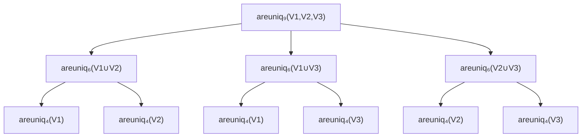

# Uniqenum and the Recursive Expression of the Vandermonde Determinant

- [1. Abstract](#1-abstract)
- [2. Introduction](#2-introduction)
- [3. Problem Definition](#3-problem-definition)
  - [3.1 Goal](#31-goal)
- [4. Theoretical Foundation](#4-theoretical-foundation)
  - [4.1 Vandermonde determinant](#41-vandermonde-determinant)
  - [4.2 Recursive framing via right triangles](#42-recursive-framing-via-right-triangles)
  - [4.3 Comparative summary of recursive strategies](#43-comparative-summary-of-recursive-strategies)
  - [4.4 Visualizing clique recursion](#44-visualizing-clique-recursion)
  - [4.5 Clique method explanation](#45-clique-method-explanation)
  - [4.6 Edge multiplicities in clique-based recursion](#46-edge-multiplicities-in-clique-based-recursion)
- [5. Design and Implementation](#5-design-and-implementation)
  - [5.1 `uniqenumN`](#51-uniqenumn)
  - [5.2 `areuniqN`](#52-areuniqn)
  - [5.3 Files and generation](#53-files-and-generation)
  - [5.4 Configuration at generation-time](#54-configuration-at-generation-time)
  - [5.5 Configuration at compile-time](#55-configuration-at-compile-time)
- [6. Bijective C identifier encoding (`ident(n)`)](#6-bijective-c-identifier-encoding-identn)
  - [6.1 Alphabet and constraints](#61-alphabet-and-constraints)
  - [6.2 Bijection structure](#62-bijection-structure)
    - [Example](#example)
  - [6.3 Length closed form](#63-length-closed-form)
  - [6.4 Inverse closed form](#64-inverse-closed-form)
  - [6.5 Stability and prefix preservation](#65-stability-and-prefix-preservation)
  - [6.6 Impact on code size](#66-impact-on-code-size)
- [7. Optimization and Trade-offs](#7-optimization-and-trade-offs)
- [8. Tooling and Usage](#8-tooling-and-usage)
- [9. Evaluation](#9-evaluation)
- [10. Standard Compliance](#10-standard-compliance)
  - [10.1 C11 and later](#101-c11-and-later)
  - [10.2 C99](#102-c99)
  - [10.3 C89](#103-c89)
  - [10.4 Preprocessor behavior](#104-preprocessor-behavior)
- [11. Discussion / Future Work](#11-discussion--future-work)
- [12. Conclusion](#12-conclusion)
- [13. Appendix](#13-appendix)
  - [13.1 Example listing (small N)](#131-example-listing-small-n)
  - [13.2 References](#132-references)

## 1. Abstract

This paper presents `uniqenum`, a family of standard C macros that generate compile-time verified enumerations, guaranteeing value uniqueness through an algebraic identity derived from the Vandermonde determinant. The method balances static safety with preprocessor limits by using recursive tiling and file segmentation strategies.

## 2. Introduction

Programming with enumerations feels safe until a conditional build flag, arithmetic initializer, or copy-pasted macro quietly assigns two names the same value. The resulting bugs manifest as unreachable `switch` labels, ioctl handlers that never fire, or ABI mismatches that only appear on particular platforms. Manual audits or linters rarely catch these collisions because the integer values are the result of nested macros and preprocessor math.

`uniqenum` tackles this issue by interpreting every enumeration definition as a proof obligation. On the programming side, the macros keep the familiar C syntax, emit `_Static_assert` checks automatically, and let build systems consume pre-generated headers. On the mathematical side, the construction leverages the Vandermonde determinant, reinterpreting compile-time uniqueness as the non-zero evaluation of a structured polynomial. The C preprocessor is simultaneously an adversary—imposing depth and file-size ceilings—and a playground where algebraic structure can be encoded into macros.

This paper caters to both audiences: programmers gain practical invariants, and mathematicians see how recursive clique tilings reduce a quadratic Vandermonde expansion to linear textual size. Throughout, the emphasis stays on method rather than any particular codebase so that the ideas can be reimplemented independently.

## 3. Problem Definition

C enumerations are often used to assign compile-time integer values to symbolic names. A typical enumeration definition is assumed to contain distinct values, because accidental duplicates silently break switch statements, lookup tables, and serialization formats.

The C standard does not require the compiler to diagnose duplicate values:

```c
enum Color {
    Red   = 1,
    Green = 1,   /* silently accepted */
    Blue  = 2
};
```

The problem becomes harder when enumeration values are computed using macros.
Two expressions may be *semantically different* yet evaluate to the *same* integer after preprocessing:

```c
#define OFFSET   0
#define FLAG_A   (1 + OFFSET)
#define FLAG_B   (2 - 1)

enum Flags {
    A = FLAG_A,    /* expands to 1 */
    B = FLAG_B     /* expands to 1: accidental collision */
};
```

Nothing warns the programmer.
The code compiles.
The bug may only appear much later, when the system behaves inconsistently, a lookup table misroutes, or a communication protocol becomes ambiguous.

A larger enumeration amplifies the problem: more values, more computed expressions, more potential collisions, and still no diagnostic.

### 3.1 Goal

We want a compile-time mechanism that:

1. guarantees that all enumeration values are distinct,
2. does not depend on compiler extensions,
3. is compliant with ISO C,
4. works in constant-expression form so it can be embedded in `_Static_assert` (compile-time assertions),
5. and scales to large enums generated mechanically,
6. is adapted for practical, everyday use when authoring or editing code.

To fulfill this goal, we propose two macro families: *areuniq* and *uniqenum*.

- `uniqenumN` expands to a valid enumeration definition with $N$ entries;
- `areuniqN` evaluates to a compile-time boolean proving that all $N$ values are distinct.

## 4. Theoretical Foundation

### 4.1 Vandermonde determinant

The classical Vandermonde determinant connects distinctness with the non-zero value of

$$
V_N(a_1,\dots,a_N) = \prod_{1 \le i < j \le N} (a_i - a_j).
$$

If any $a_i = a_j$ the corresponding factor vanishes, taking the product to zero. In `_Static_assert`, any expression that is zero iff duplicates exist is sufficient, so $V_N$ is an ideal candidate.

In practice we implement an analogue of $V_N$ by replacing each difference $(a_i - a_j) with a boolean test $(a_i \neq a_j)$. This is to circumvent C-specific overflow/underflow and undefined behavior issues. The sign and magnitude of the classical Vandermonde determinant are discarded; only its zero / non-zero behavior is preserved via boolean factors.

### 4.2 Recursive framing via right triangles

A naïve expansion enumerates all $\binom{N}{2} = \frac{N(N-1)}{2}$ differences, typically arranged as a right triangle of factors. Appending the $N$-th element simply adds one more row containing $(a_k - a_N)$ for $k < N$.

```text
(a1 - a2)
(a1 - a3)(a2 - a3)
(a1 - a4)(a2 - a4)(a3 - a4)
(a1 - a5)(a2 - a5)(a3 - a5)(a4 - a5)
(a1 - a6)(a2 - a6)(a3 - a6)(a4 - a6)(a5 - a6)
(a1 - a7)(a2 - a7)(a3 - a7)(a4 - a7)(a5 - a7)(a6 - a7)
```

Figure 1 — Vandermonde triangle representation for increasing $N$.

Recognizing this structure invites recursion: rather than emit every pair, express $V_N$ via smaller Vandermonde products that collectively cover all unordered pairs.

### 4.3 Comparative summary of recursive strategies

Four strategies were investigated before settling on the clique method. Their characteristics are summarized in Table 1.

Table 1 — Comparative summary of Vandermonde recursion strategies.

| Method          | Recurrence idea                                                       | Depth bound                  | Child sizes per level                        | Per-level textual cost (number of identi  fiers spelled)                                                   | Notes                                                                                                                                                |
| --------------- | --------------------------------------------------------------------- | ---------------------------- | -------------------------------------------- | ------------------------------------------------------------------------------------------------------- | ---------------------------------------------------------------------------------------------------------------------------------------------------- |
| Expanded        | Emit every unordered pair once                                        | 1                            | —                                            | $2\binom{N}{2} = N(N-1)$ identifiers                                                                    | Baseline; quadratic size.                                                                                                                            |
| Row             | Add rows one by one (grouped by right operand)                        | $N-1$                        | single child of size $N-1$                   | $3N-2$, reducible to $2N-1$ with additional helper macros the last row                                  | Linear but exceeds depth limits for large $N$. Can require helpers for the last row.                                                                 |
| Triangles       | Split right triangle into central near-square plus two half triangles | $\lceil \log_2 N \rceil$     | $\lfloor N/2 \rfloor$, $\lceil N/2 \rceil$   | Between $2N$ and $N+\lfloor N^2/2 \rfloor$, depending on available helpers for the central near-square. | Balances depth but requires many helper forms.                                                                                                       |
| Cliques ($k=3$) | Cover complete graph with pairwise unions of $k$ balanced partitions  | $\lceil \log_{3/2} N \rceil$ | $\lfloor 2N/3 \rfloor$, $\lceil 2N/3 \rceil$ | $N(k-1)$                                                                                                | Adopted method; linear text and shallow depth. The quadratic&rarr;linear reduction from $N(N-1)$ expanded identifiers to $N(k-1)$ is clearly visible |

### 4.4 Visualizing clique recursion

Balanced clique recursion mirrors a triangle-of-triangles tiling. The example below shows $N=9$ split into three blocks $(V_1,V_2,V_3)$.



Figure 2 — Clique-based recursion tree (k=3) for $N=9$.

The tree stops once a node size reaches the base case (typically $N \le 3$) where direct products are emitted.

### 4.5 Clique method explanation

Let $K_N$ denote the complete graph on vertices $\{1,\dots,N\}$. Associate each edge $\{i,j\}$ with the factor $(a_i - a_j)$. Any edge cover by cliques yields a valid Vandermonde expression.

**Problem statement.** Given integers $(a_1,\dots,a_N)$, define
$$
V_N(a_1,\dots,a_N) = \prod_{1 \le i < j \le N} (a_i - a_j).
$$
Find a recursively defined product of Vandermonde terms that is zero iff some $a_i = a_j$ yet grows only linearly in textual size.

**Edge–clique cover viewpoint.** Select a family of cliques $\mathcal{C} = \{C_1,\dots,C_t\}$ where each $C_k \subseteq \{1,\dots,N\}$. Define
$$
F_{\mathcal{C}} = \prod_{k=1}^t \prod_{\{i,j\} \subseteq C_k} (a_i - a_j).
$$
If every edge of $K_N$ lies in at least one $C_k$, then $F_{\mathcal{C}} = 0$ iff some pair collides. Multiplicities do not hurt because `_Static_assert` only cares about zero vs non-zero.

**Per-level cost lower bound.** When no clique spans all vertices, every vertex must appear in at least two cliques. If some vertex $v$ appeared in only one clique $C$, then for any $w \notin C$ the edge $\{v,w\}$ would be uncovered, contradicting completeness. Hence every vertex belongs to at least two cliques, so $\sum_k \lvert C_k\rvert\ge 2N$. This implies
$$
\sum_{k=1}^t |C_k| \ge 2N.
$$

**Partition construction.** Partition the vertices into $k \ge 3$ near-equal parts $V_1,\dots,V_k$. For each unordered pair $(i,j)$, add clique $C_{ij} = V_i \cup V_j$. Every intra-part edge is covered because $V_i$ participates in $(k-1)$ such unions, and every inter-part edge appears in precisely one clique. Child sizes are bounded by $\lceil 2N/k \rceil$, yielding the recurrence
$$
d(N) \le 1 + d\left(\left\lceil \frac{2N}{k} \right\rceil\right).
$$

**Choosing $k$.** Larger $k$ reduces depth but increases per-level text:

- $k=3$: depth $\lceil \log_{3/2} N \rceil$, cost $2N$.
- $k=4$: depth $\lceil \log_2 N \rceil$, cost $3N$.
Since typical compilers allow depth $D \approx 200$, $k=3$ provides optimal size without approaching the limit (even $N=10^6$ stays below 40 levels).

**Self-similarity.** The $k=3$ recursion mirrors a Sierpiński-like tiling: each level computes three smaller Vandermonde products over pairwise unions $(V_i \cup V_j)$. Parameter order is preserved so that the generator can splice slices directly.

### 4.6 Edge multiplicities in clique-based recursion

The clique method used in this paper produces a *cover* of the edges of the complete graph $K_N$, not a partition.
When a family of cliques ${C_k}$ is used to express a Vandermonde-like product

$$
F_{\mathcal{C}}
= \prod_{k} \prod_{\{i,j\}\subseteq C_k} (a_i \ne a_j),
$$

an edge ${i,j}$ may appear in several cliques whenever both endpoints lie in more than one block of the recursive partition.

This is unavoidable with $k\ge 3$ parts:
every vertex participates in $k-1$ unions $(V_i\cup V_j)$, and thus any edge whose endpoints fall into a shared pair of blocks will be spelled once per occurrence of that pair in the recursion tree.

These duplicate factors are harmless:

- logically, `(a_i != a_j)` is a boolean in `{0,1}`,
  so repeating it does not change the truth value of the full product,
- algebraically, if the product ever evaluates to zero, it is because at least one collision exists, not because a term appears twice,
- structurally, multiplicities do not affect asymptotic size, since each clique contributes only $\lvert C_k\rvert$ terms, giving the linear bound $N(k-1)$ per level.

The presence of repeated pairs in the final expanded expression therefore reflects the structure of the clique cover, not an error in the construction.
The generated C code displays these multiplicities explicitly because macro expansion has no simplification phase.

## 5. Design and Implementation

Two macro families:

- `areuniqN` expands to a pure constant expression, structurally derived from the Vandermonde product, that evaluates to non-zero if and only if all N values are distinct.
- `uniqenumN` wraps a conventional enumeration definition followed by a call to `areuniqN` with each enumerator.

Base cases (`N=2` and `N=3`) are emitted explicitly using straight products of differences. For $N \ge 4$, the generator partitions arguments into three nearly equal blocks $(A,B,C)$ and emits:

### 5.1 `uniqenumN`

Conceptually, `uniqenumN` accepts $2N+2$ parameters:

- the enumeration name,
- N alternating (key, value) slots, where a missing value means to use the implicit C enumeration rule,
- and the `typedef` name.

Informally:

```text
uniqenum<N>(enum_name,
    key1,=value1,
    key2,=value2,
    key3,,         // implicit value: previous + 1
    ...
    keyN,=valueN,
typedef_name)
```

The concrete macro signature uses generated parameter names (`a, f4, b, f5, …`) but follows this logical structure.

Base case on $N=1$: there is only one enumerator, rendering the uniqueness check unnecessary. Thus, `uniqenumN` degenerates to a simple singleton enumeration definition.

Otherwise, `uniqenumN` calls `areuniqN` with each enumeration value, which expands with the cliques method to assert uniqueness of each pair.

### 5.2 `areuniqN`

Accepts $N$ parameters.

Informally:

```text
areuniq<N: number of values>(v_1,v_2,...,v_N)
```

```c
#define areuniqN(args...) \
    areuniq_{|A∪B|}(A,B) * \
    areuniq_{|A∪C|}(A,C) * \
    areuniq_{|B∪C|}(B,C)
```

### 5.3 Files and generation

Because each `areuniqN` depends on smaller macros, headers are sharded by byte budget (for example 256 KiB). When the generator approaches the limit, it starts a new shard, emits include guards, and adds `#include` statements for all newly required child ranges. Dependency ranges shrink with $N$, so later shards often depend on only one prior shard even though earlier ones may need two.

To store the generated fixed-size header files up to large $N$ values without overloading the filesystem, we propose a prefix tree approach:

From the output directory $O$, to find the directory to put a header that provides macros in $N \in [L;R]$, apply this algorithm:

1. Convert $L$ and $R$ to decimal digits. For instance, $L=41181$ and $R=41197$;
2. Find the shared prefix of common digits, ignoring the last one. Ignoring the last character prevents creating directories that contain only one header. Here, the shared prefix is "411"
3. Group the prefix by sequences of two successive digits, dropping the last digit if the total amount is uneven. Here we have only one group: "41"
4. Each group becomes a directory name in the final path, and a descriptive filename is appended: "O/41/uniqenum_41181_41197.h"

This method provides the following benefits:

1. Limits directory size. If all headers were put in the same directory, file explorers would slow down, rendering access difficult.
2. Intuitiveness. The shared prefix groups effectively forms classes
3. Self contained. Placement computable from range only, without global state.
4. Limited depth. Using shorter groups (such as 1 digit) would reduce directory size as the cost of increasing depth, rendering search more complicated and risking hitting platform limits. Longer groups (3, 4 digits) greatly increase directory size, allowing thousands of headers to be classified in the same directory. Groups of 2 are empirically considered the best trade-off, but the exact value can be exposed for configuration.

### 5.4 Configuration at generation-time

Configurable constraints include:

- Target `N` range (single value or inclusive interval).
- Which macro families to emit (`areuniq`, `uniqenum`, or both).
- Include guard strategy (classical `#ifndef`, `#pragma once`, or omitted when embedding).
- Output destination: standard output, monolithic header, or directory tree with size-capped files.

### 5.5 Configuration at compile-time

We expose a preprocessor switch `UNIQENUM_ASSERT` that lets each translation unit choose its preferred diagnostic mode:

- 0: disable all assertions
- 1: assert-once; one `_Static_assert` checks the Vandermonde product
- 2: assert-all; each pair $(a_i, a_j)$ triggers its own `_Static_assert`

The user can also define function-like macros `UNIQUENUM_ASSERT_ONCE` and `UNIQENUM_ASSERT_ALL` to customize the static assertion code to suit their needs.

## 6. Bijective C identifier encoding (`ident(n)`)

Large Vandermonde products require macro parameters to be uniquely named, compact, and stable across generations. To avoid quadratic blowup in textual size, `uniqenum` uses an optimally concise bijective identifier encoder. This section describes the construction and shows that it achieves the minimal possible length for C identifiers under standard lexical constraints.

### 6.1 Alphabet and constraints

A C identifier must begin with an ASCII letter or underscore, and subsequent characters may additionally include digits. For portability and readability, `uniqenum` restricts itself to the following **ordered alphabet**:

- First character: `F = 52` symbols
  `a–z`, `A–Z`
- Subsequent characters: `B = 63` symbols
  `a–z`, `A–Z`, `_`, `1–9`, `0`

These choices avoid leading underscores and ensure that every identifier is valid across mainstream C toolchains. The first character cannot be numeric, hence the mixed-radix structure.

### 6.2 Bijection structure

The encoding is *bijective*:

$$
\text{ident} : \mathbb{N}_{\ge 0} \longrightarrow \mathcal{I},
$$

where $\mathcal{I}$ is the set of valid identifiers representable in this alphabet.

Identifiers are ordered lexicographically by:

1. Length first
2. Lexicographic order within each length

The family of identifiers of length $L\ge 1$ has cardinality:

$$
|\mathcal{I}_L| = F B^{L-1}.
$$

Thus the cumulative count of identifiers of length < L is:

$$
\mathrm{base}(L) = \sum_{\ell=1}^{L-1} F B^{\ell-1}
= \frac{F (B^{L-1}-1)}{B-1}.
$$

To encode an integer $n$:

1. Find the unique $L$ such that
   $$
   \mathrm{base}(L) \le n < \mathrm{base}(L+1).
   $$

2. Compute
   $$
   r = n - \mathrm{base}(L).
   $$

3. The identifier corresponds to writing $r$ in base-$B$ with a leading digit in base-$F$:
   $$
   r = d_0 B^{L-1} + d_1 B^{L-2} + \cdots + d_{L-1}.
   $$

4. The final string is:
   $$
   \text{ident}(n)  = \text{char}_F(d_0)\,\text{char}_B(d_1)\,\cdots\,\text{char}_B(d_{L-1}).
   $$

This ensures a monotone, collision-free, gap-free sequence analogous to spreadsheet columns or bijective base-26, except adapted to C's lexical grammar.

#### Example

Indices 0–55 map to:

```text
a,b,c,...,z,A,B,...,Z
```

Index 56 produces `"a_"`.
Index 57 produces `"a1"`.
Index 118 produces `"b0"`.
Everything behaves monotonically.

### 6.3 Length closed form

The inverse of the base computation gives the minimal identifier length for index $n$:

$$
L(n) =
\left\lceil
\log_{B}\left(\frac{(B-1)(n+1)}{F}\right)
\right\rceil.
$$

Because $B = 63$ is the largest alphabet allowed in portable C identifiers **after the first character**, this logarithmic growth is **asymptotically optimal**. Any identifier family respecting C's lexical rules must have length at least:

$$
\Omega(\log_{63} n).
$$

Thus `ident(n)` achieves the minimal possible average length over the entire space.

### 6.4 Inverse closed form

The inverse mapping (`identAntecedent`) reconstructs the integer pre-image:

1. Parse the identifier's characters into base-$F$ and base-$B$ digits.
2. Compute its rank among identifiers of the same length.
3. Add the cumulative count of identifiers of shorter length.

Formally, for identifier $s$ of length $L$:

$$
\mathrm{identAntecedent}(s) = \mathrm{base}(L) + d_0 B^{L-1} + d_1 B^{L-2} + \cdots + d_{L-1}.
$$

This guarantees $\mathrm{identAntecedent}(\text{ident}(n)) = n$.

### 6.5 Stability and prefix preservation

Identifiers increase by modifying the *least significant digit* first. For example:

```text
a_, a1, a2, ..., a0, ba, bb, ...
```

This produces long stable prefixes:

- useful in diffs,
- pleasant in generated code,
- and ideal for macros with hundreds of parameters, because arguments remain visually aligned.

This non-accidental "spreadsheet monotonicity” also keeps incremental generation cheap and avoids spurious diffs in build artefacts.

### 6.6 Impact on code size

The Vandermonde expansion uses every identifier in the signature of `areuniqN` and `uniqenumN`. Because each identifier appears once or twice per macro, reducing the identifier length by even a constant factor would reduce the total textual size by $\Omega(N)$. Since the current encoding achieves the **shortest possible average length allowed by C**, it contributes directly to the linear-in-N optimality of the generated headers.

In other words:

- Clique recursion minimizes the structural cost $2N$.
- Mixed-radix identifiers ensure that the lexical cost grows as $\Theta(\log N)$, which is asymptotically minimal under the C identifier constraints.
- No other encoding can beat the product of these two constraints without violating the ISO C identifier rules.

This makes `ident(n)` not a convenience, but a necessary component of `uniqenum`'s size optimality.

## 7. Optimization and Trade-offs

- **Clique vs. naïve expansion.** Cliques cut textual growth from $\Theta(N^2)$ to $\Theta(N)$ while keeping depth logarithmic. The cost bound of $2N$ per level is provably minimal for non-trivial covers.
- **Code size vs. macro depth.** Choosing $k=3$ saturates the cost lower bound; larger $k$ would outpace it without substantial depth gains for practical $N$. Triangle recursion offers slightly shallower trees but introduces sizable helper macros for the central rectangle.
- **Human readability vs. generator compactness.** Retaining ordered parameters within each block lets developers map macro arguments back to their enums, at the expense of repeating identifiers instead of using automatically numbered temporaries.
- **Deterministic identifiers.** The mixed-radix `ident` encoder maintains short names and predictable growth governed by
  $$
  c_{\text{ident}}(N) = \left\lceil \log_{63} \frac{31N}{26} \right\rceil,
  $$
  ensuring that the cumulative identifier length scales gently even for large $N$.
- **Generation compactness.** The same recursion tree drives both macro families; caching subtrees allows the generator to emit each `areuniqM` once even if multiple parents reference it.

## 8. Tooling and Usage

A command-line interface wraps the generator with options tailored for build integration:

```sh
uniqenum 2 512 --areuniq --uniqenum \
    --max-size 262144 \
    -d build/include/uniqenum \
    --guard pragmaOnce
```

Key capabilities:

- Emit a single $N$ or a range $[L, R]$, with `inf` (infinity) supported for open-ended generation (subject to `--max-size`).
- Select macro families (`--areuniq`, `--uniqenum`) and manage dependencies automatically or opt out when embedding existing proofs.
- Choose output targets: stdout streaming, monolithic header (`-o file.h`), or directory sharding with configurable byte caps.

Because dependencies are emitted in dependency order, integrating the headers requires only including the shard containing the desired `N`; its prerequisites are already chained via `#include`.

## 9. Evaluation

Quantitative evaluation focuses on macro depth, file size, and compiler impact. The generator logs depth automatically, so recording compile-time and memory becomes a matter of instrumenting a build. Table 2 is a template to be filled once benchmarks are run.

Table 2 — Placeholder for empirical results (fill in after benchmarking).

| N range  | File bytes | Max macro depth | Compile time (s) | Notes                         |
| -------- | ---------- | --------------- | ---------------- |  ----------------------------- |
| 2–64     | [TBD]      | [TBD]           | [TBD]            | Baseline sanity check.        |

The system fails gracefully in two situations:

1. **File-size cap exceeded.** The generator stops the current shard when the next macro would cross `maxBytes`, starts a new file, and records the dependency chain.
2. **Depth limit approached.** Because $d(N) \approx \log_{3/2} N$, even $N=10^6$ stays below 40 levels, so mainstream compiler limits ($D \ge 200$) are not reached. Should a stricter environment appear, switching to $k=4$ can drop the depth further at the expense of size.

A sample compiler diagnostic when duplicates are detected:

```text
uniqenum_108.h:11:72: error: static assertion failed: "enum has duplicates: color color_t"
```

When "assert all” is enabled the diagnostic pinpoints the colliding pair:

```text
uniqenum_108.h:4:22: error: static assertion failed: "duplicate enum values: BLACK and BLUE"
```

## 10. Standard Compliance

`uniqenum` is intentionally written to remain within the portable core of ISO C. It does not rely on GCC extensions, compiler builtins, variadic macros, or any syntax beyond what the standard guarantees.

### 10.1 C11 and later

Direct support via `_Static_assert`. No additional extensions or attributes are required.

### 10.2 C99

Fully supported when the user supplies a custom static-assert macro.
All Vandermonde products expand to constant expressions built only from:

- identifier references,
- integer comparisons `(a != b)`,
- and integer multiplication of `0` and `1`.

These are valid constant expressions in C99. A simple C89-compatible assertion is:

```c
#define uniqassert(expr, msg) typedef char uniqenum_check[(expr) ? 1 : -1]
```

The generator can be configured to emit `uniqassert(...)` instead of `_Static_assert`.

### 10.3 C89

The canonical implementation of `uniqenum` uses variadic macros for compile-time configuration of assertions. However, these macros are only used as a convenience and are not necessary for the uniqueness verification. Thus, C89 support is conceptually possible.

### 10.4 Preprocessor behavior

Macro recursion depth is implementation-defined, but the clique recursion ensures logarithmic depth in $\log_{3/2}N$, well below typical limits.

## 11. Discussion / Future Work

Several questions remain open:

- **Preprocessor performance ceiling.** Although textual size is linear, the preprocessor still expands products representing all unordered pairs. Measuring when this becomes impractical on various toolchains (GCC, Clang, MSVC) is future work.
- **Assertion strategy benchmarking.** "Assert all” may increase memory but shorten debugging time; comparative metrics would inform default settings.
- **Automatic refactoring tooling.** Converting existing codebases into `uniqenum` macros could be automated by parsing enums, asking the user for desired uniqueness / synonym groups, and inserting the appropriate code.
- **Alternative clique parameters.** Exploring heterogeneous $k$ per level (e.g., $k=4$ near the root, $k=3$ deeper) might optimize depth while keeping size manageable for compilers that heavily constrain macro recursion depth.
- **Packaging and distribution.** Pre-generated headers for popular ranges, along with language-specific bindings, would lower adoption friction.
- **Compiler hints.** Investigating whether compilers benefit from splitting the `_Static_assert` products into balanced trees (to limit expression complexity) could further improve robustness.

## 12. Conclusion

`uniqenum` demonstrates that algebraic reasoning can guide preprocessor meta-programming. Within the rigid constraints of the C macro system, the Vandermonde determinant offers both mathematical rigor and safety guarantees.

## 13. Appendix

### 13.1 Example listing (small N)

```c
typedef uniqenum5(color,
    BLACK,,
    RED,   =0xff0000,
    GREEN, =0x00ff00,
    BLUE,  =0x0000ff,
    WHITE, =0xffffff,
color_t);
```

Expands to the following preprocessed code:

```c
typedef enum color {
    BLACK,
    RED   = 0xff0000,
    GREEN = 0x00ff00,
    BLUE  = 0x0000ff,
    WHITE = 0xffffff
} color_t;
_Static_assert(
    ((BLACK) != (RED)) * ((BLACK) != (GREEN)) * ((RED) != (GREEN)) *
    ((BLACK) != (RED)) * ((BLACK) != (BLUE)) *
    ((RED) != (BLUE)) * ((GREEN) != (BLUE)) *
    ((BLACK) != (RED)) * ((BLACK) != (WHITE)) *
    ((RED) != (WHITE)) * ((GREEN) != (BLUE)) *
    ((GREEN) != (WHITE)) * ((BLUE) != (WHITE)),
    "enum has duplicate values: " "color" " " "color_t"
)
```

Developers may optionally split synonyms out of the check:

```c
enum {
    LEGACY_OK = 0,
    OK        = 0,
    ERROR     = 1,
};
_Static_assert(areuniq2(LEGACY_OK, ERROR), "values must diverge");
_Static_assert(LEGACY_OK == OK, "synonyms must match");
```

`areuniqN` and `uniqenumN` can be provided by a utility header unit:

```c
#ifndef UNIQa_H
#define UNIQa_H
#define uniqenum1(d,a,b,e)enum d{a b}e
#define areuniq2(a,b)((a)!=(b))
#define uniqenum2(f,a,c,b,d,g)enum f{a c,b d}g;_Static_assert(areuniq2(a,b),"enum has duplicate values: "#f" "#g)
#define areuniq3(a,b,c)areuniq2(a,b)*areuniq2(a,c)*areuniq2(b,c)
#define uniqenum3(h,a,d,b,e,c,f,i)enum h{a d,b e,c f}i;_Static_assert(areuniq3(a,b,c),"enum has duplicate values: "#h" "#i)
#define areuniq4(a,b,c,d)areuniq3(a,b,c)*areuniq3(a,b,d)*areuniq2(c,d)
#define uniqenum4(j,a,e,b,f,c,g,d,h,k)enum j{a e,b f,c g,d h}k;_Static_assert(areuniq4(a,b,c,d),"enum has duplicate values: "#j" "#k)
#define areuniq5(a,b,c,d,e)areuniq4(a,b,c,d)*areuniq3(a,b,e)*areuniq3(c,d,e)
#define uniqenum5(l,a,f,b,g,c,h,d,i,e,j,m)enum l{a f,b g,c h,d i,e j}m;_Static_assert(areuniq5(a,b,c,d,e),"enum has duplicate values: "#l" "#m)
#define areuniq6(a,b,c,d,e,f)areuniq4(a,b,c,d)*areuniq4(a,b,e,f)*areuniq4(c,d,e,f)
#define uniqenum6(n,a,g,b,h,c,i,d,j,e,k,f,l,o)enum n{a g,b h,c i,d j,e k,f l}o;_Static_assert(areuniq6(a,b,c,d,e,f),"enum has duplicate values: "#n" "#o)
// ...
#endif
```

### 13.2 References

- ISO/IEC 9899:2011 — Programming Languages — C11.
- Any introductory algebra text covering the Vandermonde determinant (e.g., Artin, *Algebra*, ch. 5).
